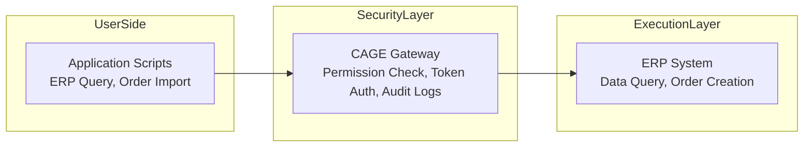
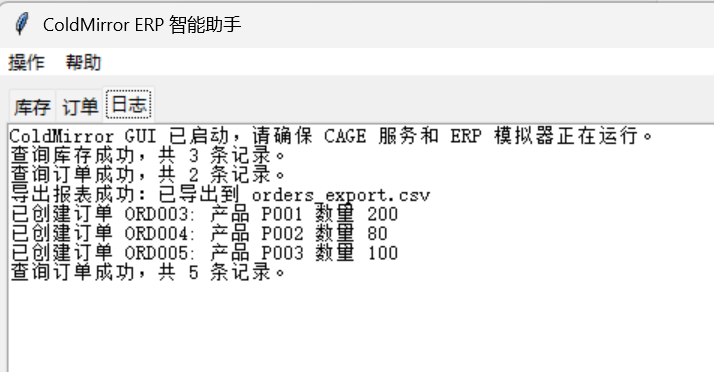

# ColdMirror: A Lightweight Agent Framework Based on CAGE


**ColdMirror** is an experimental lightweight agent framework built upon the [CAGE](https://github.com/CognitiveCityState/ColdCAGE) security isolation layer. It securely integrates large language model capabilities into concrete application scenarios through distributed scripts and a one-time token mechanism. As an engineering practice of *[The Cold Existence Model: A Fact-based Ontological Framework for AI](https://doi.org/10.6084/m9.figshare.31696846)* in the direction of **agent proxy execution**, this project aims to explore an implementation path for lightweight, controllable, and auditable AI agents.

---

## Background and Motivation

In recent years, agent frameworks (e.g., OpenClaw, AutoGPT) have made remarkable progress in exploring the autonomous execution capabilities of AI. By integrating large language models with tool invocation functionalities, these frameworks have demonstrated substantial potential for automated task processing. Meanwhile, cloud-based vertical assistants (e.g., Coze, Manus) have provided convenient AI services in specific domains, promoting the widespread adoption of AI technologies.

However, with the deepening deployment of such frameworks, several pervasive challenges have emerged:

- **System Complexity and Security Risks**: To achieve functional completeness, some agent frameworks incorporate complex modules and permission management mechanisms. In real-world deployment, agents may obtain excessive system access privileges, increasing the risk of unauthorized operations.
- **Privacy and Cost Considerations**: Cloud-based services rely on data uploading, raising concerns for privacy-sensitive users; token-based pricing can lead to high costs in scenarios requiring frequent interactions.
- **Auditability and Controllability**: The execution process of agent operations is often difficult to trace and audit. Users cannot clearly verify *what specific actions the AI performed and why*, which is particularly critical in scenarios requiring definitive accountability.

### From General Scenarios to Enterprise Core Systems

These challenges are already problematic in general office scenarios, and they become far more acute when agents attempt to access enterprise core systems such as ERP. ERP systems host an enterprise’s most sensitive data—finance, inventory, production, and human resources. Any direct agent manipulation of ERP entails severe risks:

- **Data Sovereignty**: ERP data represents the lifeblood of an enterprise and must not leave the enterprise boundary, let alone be arbitrarily transmitted to the cloud.
- **Fine-Grained Permission Control**: ERP operations require field-level permission management, which cannot be satisfied by the autonomous decision-making paradigm of AI.
- **Audit and Compliance**: Enterprises need complete and traceable operation logs to pass compliance audits such as cybersecurity classified protection and the Sarbanes–Oxley Act (SOX).
- **Business Continuity**: ERP stability directly affects enterprise operations; any erroneous operation may cause production downtime.

Currently, enterprises face a dilemma in ERP intelligence: either adopt functionally limited cloud assistants that cannot penetrate the ERP core, or experiment with open-source agent frameworks that introduce unacceptable security risks. Neither can satisfy the core demand of **enabling AI to operate ERP securely**.

Without negating the exploratory value of existing frameworks, ColdMirror pursues an alternative approach: it abandons the pursuit of all-encompassing functionality and focuses instead on **security isolation** and **minimalist controllability**. Its core logic is to return LLMs to their strength in content generation, delegate concrete operational execution to lightweight scripts, and enforce secure authorization and auditing for all operations via the CAGE layer.

---

## Core Architecture: Distributed Design with CAGE as the Foundation

ColdMirror is architected on top of the CAGE security isolation layer, decomposing agent tasks into three independent components:



### 1. User Side: Application Scripts
Each ERP scenario (e.g., inventory query, order import) corresponds to an independent lightweight script. Scripts are responsible for:
- Sending structured operation requests (e.g., `erp_query_inventory`, `erp_create_order`) to the CAGE gateway
- Receiving execution results returned by CAGE

Scripts themselves hold no system privileges; all actual operations are performed exclusively through CAGE. This design fully decouples business logic from security mechanisms, keeping individual scripts concise—core logic typically fits within hundreds of lines of code, enabling easy maintenance and extension.

### 2. Security Layer: CAGE Gateway
ColdMirror reuses CAGE’s full security mechanisms:
- **Permission Verification**: Checks whether requests are whitelisted and parameters are valid
- **One-Time Tokens**: Generates a unique token for each operation, which is immediately invalidated after use
- **Audit Logs**: Records all requests and operations for post-hoc traceability

The CAGE gateway runs as an independent service, holding ERP access credentials, but only proxies authorized operations after successful token validation.

### 3. Execution Layer: ERP System
The CAGE gateway interacts with the real ERP system (or simulator) to execute authorized operations. Within ColdMirror, the LLM is encapsulated inside CAGE (or deployed as a separate service), with outputs limited to content generation (e.g., parsed natural-language instructions) without direct system calls.

---

## Technical Implementation

ColdMirror does not reimplement security mechanisms but uses CAGE as its security foundation. Users only need to write scenario-specific scripts and invoke CAGE’s APIs to obtain end-to-end security isolation.

### Example CAGE API Invocation

```python
import requests

CAGE_URL = "http://127.0.0.1:5000"

def request_cage_token(action, params):
    resp = requests.post(f"{CAGE_URL}/request_token", json={"action": action, "params": params})
    return resp.json()["token"]

def execute_cage_token(token):
    resp = requests.post(f"{CAGE_URL}/execute", json={"token": token})
    return resp.json()["result"]
```

### Typical Script Structure (ERP Inventory Query)

```python
# query_inventory.py
token = request_cage_token("erp_query_inventory", {})
result = execute_cage_token(token)
print(result)
```

All example scripts are located in the `examples/` directory and can be run directly for reference.

---

## Case Demonstration: Secure ERP Agent

The following is a complete demonstration of ColdMirror integrated with CAGE in ERP scenarios, adhering to the principles of **read-only priority, human confirmation, and sandbox isolation**. The demonstration environment includes:
- **ERP Simulator**: Mimics an enterprise ERP system, providing APIs for inventory query, order query, order export, and order creation
- **CAGE Service**: Security gateway handling token authorization and auditing
- **GUI Interface**: Intuitively displays operations and results

### Demonstration Flow

1. **Service Startup**: Launch the CAGE service and ERP simulator separately
2. **Read-Only Operations**: Query inventory, query orders, and export order reports via the GUI
3. **Write Operations**: Import orders from Excel, executed only after manual confirmation
4. **Result Verification**: Re-query orders to confirm successful creation of new orders

### CAGE Service Logs (Key Operations)

```
[START] CAGE service running at http://127.0.0.1:5000

[REQUEST] Received token request: action=erp_query_inventory
[AUTH] Token generated -> erp_query_inventory
[EXECUTE] Operation erp_query_inventory succeeded, token destroyed
[RESPONSE] Returned inventory data: Bolt(P001) 85, Nut(P002) 230, Washer(P003) 500

[REQUEST] Received token request: action=erp_query_orders
[AUTH] Token generated -> erp_query_orders
[EXECUTE] Operation erp_query_orders succeeded, token destroyed
[RESPONSE] Returned order data: ORD001(100 pending), ORD002(50 completed)

[REQUEST] Received token request: action=erp_export_orders (format=csv)
[AUTH] Token generated -> erp_export_orders
[EXECUTE] Operation erp_export_orders succeeded, token destroyed
[RESPONSE] Order report exported to orders_export.csv

[REQUEST] Received token request: action=erp_create_order (P001, 200)
[AUTH] Token generated -> erp_create_order
[EXECUTE] Operation erp_create_order succeeded, token destroyed
[RESPONSE] Order ORD003 created (pending)

[REQUEST] Received token request: action=erp_create_order (P002, 80)
[AUTH] Token generated -> erp_create_order
[EXECUTE] Operation erp_create_order succeeded, token destroyed
[RESPONSE] Order ORD004 created (pending)

[REQUEST] Received token request: action=erp_create_order (P003, 100)
[AUTH] Token generated -> erp_create_order
[EXECUTE] Operation erp_create_order succeeded, token destroyed
[RESPONSE] Order ORD005 created (pending)

[REQUEST] Received token request: action=erp_query_orders
[AUTH] Token generated -> erp_query_orders
[EXECUTE] Operation erp_query_orders succeeded, token destroyed
[RESPONSE] Returned order data (including three newly created orders)
```

### ERP Simulator Logs

```
[START] ERP simulator running at http://127.0.0.1:5001

[PROCESS] GET /inventory → Return inventory data
[PROCESS] GET /orders → Return order data
[PROCESS] GET /export/orders → Export order CSV file
[PROCESS] POST /orders (P001, 200) → Create order ORD003
[PROCESS] POST /orders (P002, 80) → Create order ORD004
[PROCESS] POST /orders (P003, 100) → Create order ORD005
[PROCESS] GET /orders → Return updated order data
```

### GUI Demonstration Result

The following shows the final interface of the ColdMirror GUI after completing the above operations:



---

## Running Guide

1. **Environment Requirements**: Python 3.8+, with Flask, requests, pandas, openpyxl installed (`pip install flask requests pandas openpyxl`)
2. **Code Download**: Clone this repository
3. **Generate Demo Data**: Run `python main.py` and select option `1`
4. **Start CAGE Service**: Run `python main.py` and select option `2` (keep this terminal active)
5. **Start ERP Simulator**: Open a new terminal, run `python main.py` and select option `3` (keep this terminal active)
6. **Launch GUI**: Open a third terminal and run `python gui.py`
7. **Operate the Demo**: In the GUI, click *Query Inventory*, *Query Orders*, *Export Report*, *Import Orders from Excel* (with confirmation) sequentially and inspect results

> All ERP operations are restricted to a simulated environment and do not involve real enterprise data. In production deployment, simply replace `erp_simulator.py` with real ERP API calls while retaining the whitelist and logging mechanisms.

---

## Positioning and Value of ColdMirror

ColdMirror is designed as a **lightweight complement** to existing agent frameworks, rather than a replacement for complex alternatives. Its core value lies in:

- **Security Isolation**: Built on CAGE; all ERP operations require token authorization, and scripts cannot directly access the ERP system
- **Controllability and Auditability**: Write operations require manual confirmation; CAGE logs all actions to meet enterprise compliance requirements
- **Data Sovereignty**: The ERP simulator and CAGE service can be fully deployed on-premises, ensuring data never leaves the enterprise boundary
- **Lightweight Deployment**: Core logic is decoupled from scenario-specific code; new functions only require independent scripts without modifying the core system

---

## Limitations and Future Work

As an early engineering exploration, ColdMirror has clear limitations:

- **LLM Integration**: The current demo does not connect to real LLM APIs; users initiate operations manually via GUI or scripts. Future versions will integrate LLMs (e.g., Qwen, ChatGPT) to parse natural-language instructions into structured requests for true agent behavior.
- **Scenario Expansion**: Only four scenarios are implemented: inventory query, order query, export, and import. More business operations will be added according to enterprise requirements.
- **Complex Workflows**: Multi-step, dependency-based tasks are not yet supported; state tracking will be introduced in future iterations.

We welcome developers interested in agent security and ERP intelligence to join discussions and experiments, jointly exploring this minimalist and controllable path for agent implementation.

---

## Citation

Lu, Y. (2026). *The Cold Existence Model: A Fact-based Ontological Framework for AI*. figshare. [https://doi.org/10.6084/m9.figshare.31696846](https://doi.org/10.6084/m9.figshare.31696846)
Lu, Y. (2025). *Deconstructing the Dual Black Box: A Plug-and-Play Cognitive Framework for Human-AI Collaborative Enhancement and Its Implications for AI Governance*. arXiv. [https://doi.org/10.48550/arXiv.2512.08740](https://doi.org/10.48550/arXiv.2512.08740)
CAGE Repository: [https://github.com/CognitiveCityState/ColdCAGE](https://github.com/CognitiveCityState/ColdCAGE)

---

## AI-Assisted Statement

During the conception and development of ColdMirror, AI tools (DeepSeek, Doubao) provided auxiliary support. Their specific contributions are as follows:

- **Human Author**: Collaborated with Doubao AI and DeepSeek to analyze the limitations of existing agent frameworks, discuss technical challenges in agent-ERP integration, proposed the core vision of unifying ERP and agents via the ColdMirror paradigm, and led overall architecture design, key decisions, and final result review.
- **DeepSeek**: Implemented the CAGE server, ERP simulator, GUI interface, and all demonstration scripts according to the author’s design, and produced the initial draft of this README.
- **Doubao AI**: Assisted in summarizing technical characteristics of mainstream agent frameworks and provided scenario analysis for agent-ERP integration.

The use of AI tools was strictly limited to auxiliary work and does not constitute original contribution. All core ideas, architectural decisions, and final content validation of the project were independently completed by the human author.
