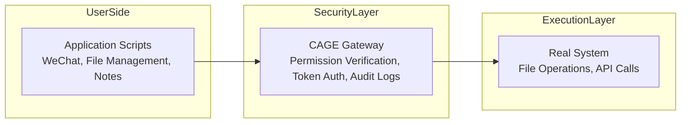

# ColdMirror: A Lightweight Agent Framework Based on CAGE


**ColdMirror** is an experimental lightweight agent framework built on the [CAGE](https://github.com/CognitiveCityState/ColdCAGE) security isolation layer. It securely integrates large language model (LLM) capabilities into specific application scenarios through distributed scripts and a one-time token mechanism. This project represents the engineering practice of *[The Cold Existence Model: A Fact-based Ontological Framework for AI](https://doi.org/10.6084/m9.figshare.31696846)* in the direction of "agent proxy execution," aiming to explore a "lightweight, controllable, and auditable" implementation path for AI agents.

---

## Background and Motivation

In recent years, agent frameworks (e.g., OpenClaw, AutoGPT) have made significant progress in exploring AI's autonomous execution capabilities. By combining LLMs with tool-calling functionalities, these frameworks have demonstrated enormous potential for automated task processing. Meanwhile, cloud-based vertical assistants (e.g., Kouzzi, Manus) have also provided convenient AI services in specific domains, promoting the popularization of AI technology.

However, with the in-depth application of these frameworks, several universal challenges have gradually emerged:

- **System Complexity and Security Risks**: To pursue functional completeness, some agent frameworks introduce complex modules and permission management mechanisms. In practical deployment, agents may gain unexpected system access permissions, increasing the risk of unauthorized operations.
- **Privacy and Cost Considerations**: Cloud-based services rely on data uploads, which raises concerns for privacy-sensitive users; the token-based billing model may incur high usage costs in scenarios requiring frequent interactions.
- **Auditability and Controllability**: The process of agent-executed operations is often difficult to track and audit. Users struggle to confirm "what exactly the AI did and why," which is particularly problematic in scenarios requiring clear responsibility attribution.

ColdMirror attempts to explore a different path: while acknowledging the exploratory value of existing frameworks, it does not pursue comprehensive functionality but focuses on "security isolation" and "minimalist controllability." Its core idea is to return LLMs to their strengths in content generation, while delegating specific operation execution to lightweight scripts. The CAGE layer ensures secure authorization and auditing of all operations.

---

## Core Architecture: Distributed Design with CAGE as the Foundation

ColdMirror's architecture is built on the CAGE security isolation layer, decomposing agent tasks into three independent components:



### 1. User Side: Application Scripts
Each application scenario (e.g., WeChat message processing, local file organization) corresponds to an independent lightweight script. The script is responsible for:
- Sending structured operation requests (e.g., `organize_downloads`, `format_clipboard`) to the CAGE gateway.
- Receiving execution results returned by CAGE.

The script itself does not possess any system permissions; all actual operations are completed through CAGE. This design completely decouples business logic from security mechanisms, allowing individual scripts to remain concise. Core logic is typically confined to hundreds of lines of code, facilitating maintenance and extension.

### 2. Security Layer: CAGE Gateway
Reuses CAGE's complete security mechanisms:
- **Permission Verification**: Checks if the request is in the whitelist and if parameters are compliant.
- **One-Time Token**: Generates a unique token for each operation, which is immediately invalidated after use.
- **Audit Logs**: Records all requests and operations for post-hoc tracing.

The CAGE gateway runs as an independent service, holding real system permissions (e.g., file read/write, API keys), but only proxies operations after token verification is successful.

### 3. Execution Layer: Real System
The CAGE gateway interacts with the real system to execute authorized operations. Within the ColdMirror framework, the LLM is encapsulated within CAGE (or as an independent service), and its output is limited to content generation (e.g., text responses, formatted results) without directly triggering any system calls.

---

## Technical Implementation

ColdMirror does not reimplement security mechanisms but leverages CAGE as its security foundation. Users only need to write scripts for application scenarios and call CAGE-provided APIs to gain full security isolation capabilities.

### CAGE API Call Example

```python
import requests

CAGE_URL = "http://127.0.0.1:5000"

def request_cage_token(action, params):
    resp = requests.post(f"{CAGE_URL}/request_token", json={"action": action, "params": params})
    return resp.json()["token"]

def execute_cage_token(token):
    resp = requests.post(f"{CAGE_URL}/execute", json={"token": token})
    return resp.json()["result"]
```

### Typical Script Structure (File Organization Example)

```python
# organize_downloads.py
token = request_cage_token("organize_downloads", {
    "source_dir": "./demo_safe/Downloads",
    "target_base": "./demo_safe/Documents"
})
result = execute_cage_token(token)
print(result)
```

All example scripts are located in the `examples/` directory of this repository and can be directly referenced and run.

---

## Case Demonstration

The following are three typical scenario demonstrations of ColdMirror combined with CAGE. All operations are performed in an isolated environment (the `demo_safe` directory).

### Scenario 1: Automatic Classification and Organization of Local Download Folders

**Function**: Classifies files in `demo_safe/Downloads` into subfolders (Pictures, Documents, Archives) under `demo_safe/Documents`. Only moves files; no deletion operations are performed.

**Execution Flow** (CAGE Server Logs):

```
[INFO] Received token request: action=organize_downloads, source_dir=./demo_safe/Downloads, target_base=./demo_safe/Documents
[INFO] Token generated: 1e3bd976676a585853edfb36e6cfcc9c -> organize_downloads
[INFO] Received execution request: token=1e3bd976676a585853edfb36e6cfcc9c
[INFO] Executing operation: organize_downloads (token destroyed)
[INFO] Execution result: Files in demo_safe/Downloads have been organized
```

**Execution Effect** (Changes in the `demo_safe` Directory):


---

### Scenario 2: Clipboard Text Formatting

**Function**: Organizes text in the clipboard (e.g., a shopping list) into a clear bulleted list and writes it back to the clipboard.

**Execution Flow**:

```
[INFO] Received token request: action=format_clipboard
[INFO] Token generated: fc97941cd64ed9fa8f6a3d02dffde06f -> format_clipboard
[INFO] Received execution request: token=fc97941cd64ed9fa8f6a3d02dffde06f
[INFO] Executing operation: format_clipboard (token destroyed)
[INFO] Execution result:
- Groceries: Eggs, Milk, Bread
- Fruits: Bananas, Apples, Oranges
- Kitchen Supplies: Paper Towels, Dish Soap
- Others: Trash Bags, Plastic Wrap
```

> Note: The current demo version processes text using simple rules. In practical applications, it can be replaced with a lightweight LLM API for better formatting results.

---

## Scenario 3: Automatic Summarization of Local Notes (Security Mechanism Demonstration)

**Function**: Reads content from `demo_safe/notes.txt` and generates a `summary.md` briefing. The current version focuses on demonstrating security mechanisms, using simple content copying (or extraction) as an example. In practical applications, the actual summary generation logic (e.g., calling an LLM API or local summarization algorithm) can be integrated as needed.

**Execution Flow** (CAGE Server Logs):

```
[INFO] Received token request: action=summarize_notes, input_path=./demo_safe/notes.txt, output_path=./demo_safe/summary.md
[INFO] Token generated: 9e283a3daa1c8444e957558cd3c622d0 -> summarize_notes
[INFO] Received execution request: token=9e283a3daa1c8444e957558cd3c622d0
[INFO] Executing operation: summarize_notes (token destroyed)
[INFO] Execution result: Briefing generated: demo_safe/summary.md
```

**Generated Briefing Example** (`summary.md`):

```markdown
# Daily Briefing

2026-03-24 Discussion on CAGE Architecture
- Security isolation is superior to behavioral constraints
- One-time token mechanism
- Ultra-lightweight implementation

2026-03-25 Proof of Concept (PoC) Validation
- Three scenarios passed
- Next step: Integrate ColdMirror
```

> **Explanation**: The content of the briefing in this demonstration is directly extracted from the input note file without intelligent summarization. In actual deployment, the implementation of the `summarize_notes` action can be replaced to integrate real summarization capabilities (e.g., LLM API). The primary purpose of the current demonstration is to validate CAGE's security authorization and auditing mechanisms, not to showcase the summarization algorithm itself.

---

## Running Guide

1. **Environment Requirements**: Python 3.8+, with Flask and requests installed (`pip install flask requests`).
2. **Download Code**: Clone this repository.
3. **Start the CAGE Server**:
   ```bash
   python cage_server.py
   ```
4. **Run Scenario Scripts** (in another terminal):
   ```bash
   python examples/organize_downloads.py
   ```

> All operations are restricted to the `demo_safe` directory by default. Paths can be extended by modifying the scripts, but it is recommended to maintain whitelist constraints.

---

## Positioning and Value of ColdMirror

ColdMirror is designed as a **lightweight supplement** to existing agent frameworks, not a replacement for complex ones. Its potential value is reflected in:

- **Security Isolation**: Built on CAGE, it inherits complete security mechanisms, requiring token authorization for all operations.
- **Lightweight Deployment**: Core logic is decoupled from specific scenarios. New functionalities only require writing independent scripts without modifying the core system.
- **Controllable Costs**: LLMs are only used for content generation, resulting in low token consumption; the CAGE service runs locally with no additional computing overhead.
- **Auditability**: CAGE logs all operations, facilitating post-hoc tracing and compliance reviews.

---

## Limitations and Future Work

ColdMirror is a preliminary engineering exploration with clear boundaries:

- **Script Coverage**: Currently, only three scenarios (file organization, clipboard formatting, note summarization) are implemented, requiring extension as needed.
- **LLM Integration**: The current demo version does not integrate real LLM APIs, which can be added in practical applications.
- **Complex Workflows**: Multi-step tasks with dependencies are not yet supported; state tracking can be introduced in the future.

We welcome developers interested in agent security and lightweight architectures to participate in discussions and experiments, jointly exploring this "minimalist and controllable" implementation path for AI agents.

---

## Citation

Lu, Y. (2026). *The Cold Existence Model: A Fact-based Ontological Framework for AI*. figshare. [https://doi.org/10.6084/m9.figshare.31696846](https://doi.org/10.6084/m9.figshare.31696846)
Lu, Y. (2025). *Deconstructing the Dual Black Box: A Plug-and-Play Cognitive Framework for Human-AI Collaborative Enhancement and Its Implications for AI Governance*. arXiv. [https://doi.org/10.48550/arXiv.2512.08740](https://doi.org/10.48550/arXiv.2512.08740)<br>
CAGE Project Repository: [https://github.com/CognitiveCityState/ColdCAGE](https://github.com/CognitiveCityState/ColdCAGE)

---

## AI-Assisted Statement

During the conception and development of the ColdMirror project, artificial intelligence tools (DeepSeek, Doubao) provided auxiliary support. Specific contributions are as follows:

- **Human Author**: Based on observations of existing agent frameworks, proposed the core concept of "distributed scripts + security middleware," and led the overall architectural design, key decisions, and result review.
- **Artificial Intelligence Tools**: Assisted in sorting out the technical characteristics of existing agent frameworks, provided integration ideas for CAGE as the security foundation, completed the code implementation of the CAGE server and scenario scripts, and generated the initial draft of this README document.

The use of artificial intelligence tools is strictly limited to auxiliary work and does not constitute any original contribution. The core ideas, architectural choices, and final content confirmation of the project were independently completed by the human author.
