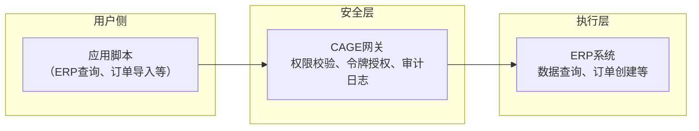

# ColdMirror：基于CAGE的轻量化智能体框架

  
**ColdMirror**是一个实验性的轻量级智能体框架，基于[CAGE](https://github.com/CognitiveCityState/ColdCAGE)安全隔离层构建，通过分布式脚本与一次性令牌机制，将大模型的能力安全地接入具体应用场景。本项目是《[冷存在模型：一个基于事实的人工智能本体论框架](https://doi.org/10.6084/m9.figshare.31696846)》在“智能体代执行”方向上的工程实践，旨在探索“轻量、可控、可审计”的智能体实现路径。

---

## 背景与动机

近年来，智能体框架（如OpenClaw、AutoGPT等）在探索AI自主执行能力方面取得了显著进展。这些框架通过将大模型与工具调用能力结合，展示了智能体在自动化任务处理上的巨大潜力。与此同时，云端垂直助手（如扣子、Manus等）也在特定领域提供了便捷的AI服务，推动了AI技术的普及。

然而，随着这些框架的深入应用，一些普遍性的挑战也逐渐显现：

- **系统复杂度与安全风险**：部分智能体框架为了追求功能的完整性，引入了复杂的模块和权限管理机制。在实际部署中，智能体可能获得超出预期的系统访问权限，增加了越权操作的风险。
- **隐私与成本考量**：云端服务依赖数据上传，对隐私敏感的用户构成顾虑；而按token计费的模式在需要频繁交互的场景下，可能带来较高的使用成本。
- **审计与可控性**：智能体执行操作的过程往往难以追踪和审计，用户难以确认“AI具体做了什么、为什么这么做”，这在需要明确责任归属的场景中尤为突出。

### 从通用场景到企业核心系统

上述挑战在通用办公场景中已足够棘手，当智能体试图触碰企业核心系统（如ERP）时，问题变得更为复杂。ERP系统承载着企业最敏感的数据——财务、库存、生产、人力资源。任何智能体直接操作ERP，都意味着巨大的风险：

- **数据主权**：ERP数据是企业的命脉，不能离开企业边界，更不允许被随意传输到云端。
- **权限控制**：ERP操作需要精确到字段级别的权限管理，AI“自主决策”的模式无法满足审计要求。
- **审计合规**：企业需要完整、可追溯的操作日志，以通过等保、SOX等合规审查。
- **业务连续性**：ERP的稳定性直接影响企业运转，任何误操作都可能导致生产中断。

目前，企业在ERP智能化方面面临两难：要么采用功能受限的云端助手（无法深入ERP核心），要么尝试开源智能体框架（安全风险难以接受）。两者都无法满足“安全地让AI操作ERP”这一核心需求。

ColdMirror尝试探索一条不同的路径：在尊重现有框架探索价值的基础上，不追求功能的大而全，而是聚焦于“安全隔离”与“极简可控”。其核心思路是：让大模型回归其最擅长的内容生成角色，而将具体操作执行交由轻量级脚本完成，并通过CAGE层实现所有操作的安全授权与审计。

---

## 核心架构：以CAGE为底座的分布式设计

ColdMirror的架构建立在CAGE安全隔离层之上，将智能体任务拆解为三个独立的部分：



### 1. 用户侧：应用脚本
每个ERP应用场景（如库存查询、订单导入）对应一个独立的轻量级脚本。脚本负责：
- 向CAGE网关发送结构化操作请求（如`erp_query_inventory`、`erp_create_order`）
- 接收CAGE返回的执行结果

脚本本身不包含任何系统权限，所有实际操作均通过CAGE完成。这种设计将业务逻辑与安全机制完全解耦，使得单个脚本的实现可以保持简洁，核心逻辑通常可控制在数百行代码内，易于维护和扩展。

### 2. 安全层：CAGE网关
复用CAGE的完整安全机制：
- **权限校验**：检查请求是否在白名单内、参数是否合规
- **一次性令牌**：为每个操作生成唯一令牌，令牌使用后立即失效
- **审计日志**：记录所有请求与操作，便于事后追溯

CAGE网关作为独立服务运行，持有ERP系统的访问权限，但仅在令牌校验通过后代理执行操作。

### 3. 执行层：ERP系统
CAGE网关负责与真实的ERP系统（或模拟器）交互，执行经过授权的操作。大模型在ColdMirror框架中被封装在CAGE内部（或作为独立服务），其输出仅限于内容生成（如自然语言指令的解析结果），不直接触发任何系统调用。

---

## 技术实现

ColdMirror本身不重新实现安全机制，而是以CAGE为安全底座。用户只需为ERP场景编写脚本，调用CAGE提供的API即可获得完整的安全隔离能力。

### CAGE API调用示例

```python
import requests

CAGE_URL = "http://127.0.0.1:5000"

def request_cage_token(action, params):
    resp = requests.post(f"{CAGE_URL}/request_token", json={"action": action, "params": params})
    return resp.json()["token"]

def execute_cage_token(token):
    resp = requests.post(f"{CAGE_URL}/execute", json={"token": token})
    return resp.json()["result"]
```

### 典型脚本结构（以ERP库存查询为例）

```python
# query_inventory.py
token = request_cage_token("erp_query_inventory", {})
result = execute_cage_token(token)
print(result)
```

所有示例脚本位于本仓库的 `examples/` 目录下，可直接参考运行。

---

## 案例演示：ERP安全智能体

以下为ColdMirror结合CAGE在ERP场景中的完整演示，所有操作遵循“只读优先、确认至上、沙箱隔离”原则。演示环境包括：
- **ERP模拟器**：模拟企业ERP系统，提供库存查询、订单查询、订单导出、订单创建等API
- **CAGE服务**：安全网关，负责令牌授权与审计
- **GUI界面**：直观展示操作过程与结果

### 演示流程

1. **启动服务**：分别启动CAGE服务与ERP模拟器
2. **只读操作**：通过GUI查询库存、查询订单、导出订单报表
3. **写入操作**：从Excel导入订单，系统要求人工确认后执行
4. **结果验证**：再次查询订单，确认新订单已创建

### CAGE服务日志（关键操作记录）

```
[启动] CAGE 服务运行于 http://127.0.0.1:5000

[请求] 收到令牌请求: action=erp_query_inventory
[授权] 令牌生成 -> erp_query_inventory
[执行] 操作 erp_query_inventory 执行成功，令牌已销毁
[响应] 返回库存数据: 螺栓(P001) 85, 螺母(P002) 230, 垫圈(P003) 500

[请求] 收到令牌请求: action=erp_query_orders
[授权] 令牌生成 -> erp_query_orders
[执行] 操作 erp_query_orders 执行成功，令牌已销毁
[响应] 返回订单数据: ORD001(100 pending), ORD002(50 completed)

[请求] 收到令牌请求: action=erp_export_orders (format=csv)
[授权] 令牌生成 -> erp_export_orders
[执行] 操作 erp_export_orders 执行成功，令牌已销毁
[响应] 订单报表已导出到 orders_export.csv

[请求] 收到令牌请求: action=erp_create_order (P001, 200)
[授权] 令牌生成 -> erp_create_order
[执行] 操作 erp_create_order 执行成功，令牌已销毁
[响应] 订单 ORD003 已创建（pending）

[请求] 收到令牌请求: action=erp_create_order (P002, 80)
[授权] 令牌生成 -> erp_create_order
[执行] 操作 erp_create_order 执行成功，令牌已销毁
[响应] 订单 ORD004 已创建（pending）

[请求] 收到令牌请求: action=erp_create_order (P003, 100)
[授权] 令牌生成 -> erp_create_order
[执行] 操作 erp_create_order 执行成功，令牌已销毁
[响应] 订单 ORD005 已创建（pending）

[请求] 收到令牌请求: action=erp_query_orders
[授权] 令牌生成 -> erp_query_orders
[执行] 操作 erp_query_orders 执行成功，令牌已销毁
[响应] 返回订单数据（包含新增的三条订单）
```

### ERP模拟器日志

```
[启动] ERP 模拟器运行于 http://127.0.0.1:5001

[处理] GET /inventory → 返回库存数据
[处理] GET /orders → 返回订单数据
[处理] GET /export/orders → 导出订单 CSV 文件
[处理] POST /orders (P001, 200) → 创建订单 ORD003
[处理] POST /orders (P002, 80) → 创建订单 ORD004
[处理] POST /orders (P003, 100) → 创建订单 ORD005
[处理] GET /orders → 返回更新后的订单数据
```

### GUI演示结果

以下为ColdMirror GUI在完成上述操作后的最终界面展示：


---

## 运行指南

1. **环境要求**：Python 3.8+，需安装 Flask、requests、pandas、openpyxl（`pip install flask requests pandas openpyxl`）
2. **下载代码**：克隆本仓库
3. **生成演示数据**：运行 `python main.py` 选择 `1`
4. **启动CAGE服务**：运行 `python main.py` 选择 `2`（该终端需保持运行）
5. **启动ERP模拟器**：另开终端，运行 `python main.py` 选择 `3`（该终端需保持运行）
6. **运行GUI**：再开一个终端，运行 `python gui.py`
7. **操作演示**：在GUI中依次点击“查询库存”“查询订单”“导出报表”“从Excel导入订单”（导入时需确认），观察结果

> 所有ERP操作限定在模拟环境中，不涉及真实企业数据。实际部署时，只需替换 `erp_simulator.py` 为真实ERP API调用，并保持白名单与日志机制不变。

---

## ColdMirror的定位与价值

ColdMirror的设计定位是作为智能体框架的**轻量化补充**，而非替代现有复杂框架。其潜在价值体现在：

- **安全隔离**：以CAGE为底座，所有ERP操作需经令牌授权，脚本无权直接触碰ERP系统
- **可控可审计**：写入操作需人工确认，CAGE完整记录所有操作，满足企业合规要求
- **数据主权**：ERP模拟器与CAGE服务可完全本地部署，数据不出企业边界
- **轻量部署**：核心逻辑与具体场景解耦，新增功能只需编写独立脚本，无需修改核心系统

---

## 局限性与未来工作

ColdMirror是一个初步的工程探索，存在明确的边界：

- **大模型集成**：当前演示未接入真实大模型API，用户需通过GUI或脚本手动发起操作。下一步可接入大模型（如通义千问、ChatGPT），将自然语言指令解析为结构化请求，实现真正的“智能体”
- **场景扩展**：当前实现库存查询、订单查询、导出、导入四个场景，需按企业实际需求扩展更多业务操作
- **复杂工作流**：暂未支持多步骤、依赖关系的复杂任务，未来可引入状态跟踪

我们欢迎对智能体安全、ERP智能化感兴趣的开发者参与讨论和实验，共同探索这一“极简可控”的智能体实现路径。

---

## 引用

Lu, Y. (2026). *The Cold Existence Model: A Fact-based Ontological Framework for AI*. figshare. [https://doi.org/10.6084/m9.figshare.31696846](https://doi.org/10.6084/m9.figshare.31696846)  
Lu, Y. (2025). *Deconstructing the Dual Black Box: A Plug-and-Play Cognitive Framework for Human-AI Collaborative Enhancement and Its Implications for AI Governance*. arXiv. [https://doi.org/10.48550/arXiv.2512.08740](https://doi.org/10.48550/arXiv.2512.08740)  <br>
CAGE 项目仓库：[https://github.com/CognitiveCityState/ColdCAGE](https://github.com/CognitiveCityState/ColdCAGE)

---

## AI辅助声明

在ColdMirror项目的构思与开发过程中，人工智能工具（DeepSeek、豆包）提供了辅助支持。具体贡献如下：

- **人类作者**：与豆包AI、DeepSeek共同分析了现有智能体框架的现状与不足，探讨了智能体与ERP结合的技术难点，提出了基于ColdMirror路径尝试将ERP与智能体结合的核心构想，并主导了整体架构设计、关键决策及成果审核。
- **DeepSeek**：根据人类作者的构想，完成了CAGE服务端、ERP模拟器、GUI界面及所有演示脚本的代码实现，并生成了本README文档的初稿。
- **豆包AI**：协助梳理了现有智能体框架的技术特点，提供了智能体与ERP结合的场景分析。

人工智能工具的使用严格限于辅助性工作，不构成原创性贡献。项目的核心思想、架构选择及最终内容的确认均由人类作者独立完成。
