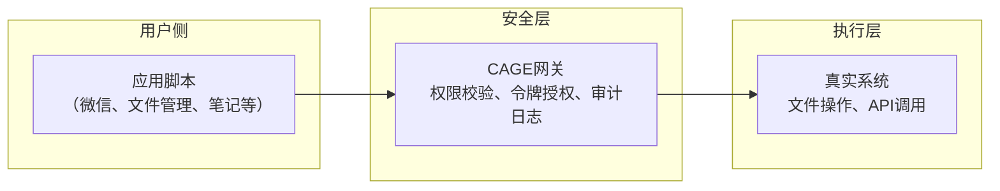
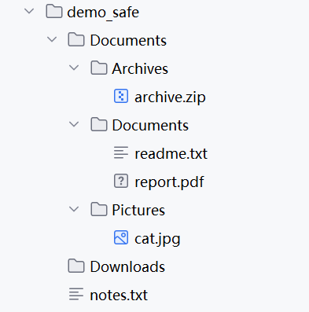

# ColdMirror：基于CAGE的轻量化智能体框架

  
**ColdMirror**是一个实验性的轻量级智能体框架，基于[CAGE](https://github.com/CognitiveCityState/ColdCAGE)安全隔离层构建，通过分布式脚本与一次性令牌机制，将大模型的能力安全地接入具体应用场景。本项目是《[冷存在模型：一个基于事实的人工智能本体论框架](https://doi.org/10.6084/m9.figshare.31696846)》在“智能体代执行”方向上的工程实践，旨在探索“轻量、可控、可审计”的智能体实现路径。

---

## 背景与动机

近年来，智能体框架（如OpenClaw、AutoGPT等）在探索AI自主执行能力方面取得了显著进展。这些框架通过将大模型与工具调用能力结合，展示了智能体在自动化任务处理上的巨大潜力。与此同时，云端垂直助手（如扣子、Manus等）也在特定领域提供了便捷的AI服务，推动了AI技术的普及。

然而，随着这些框架的深入应用，一些普遍性的挑战也逐渐显现：

- **系统复杂度与安全风险**：部分智能体框架为了追求功能的完整性，引入了复杂的模块和权限管理机制。在实际部署中，智能体可能获得超出预期的系统访问权限，增加了越权操作的风险。
- **隐私与成本考量**：云端服务依赖数据上传，对隐私敏感的用户构成顾虑；而按token计费的模式在需要频繁交互的场景下，可能带来较高的使用成本。
- **审计与可控性**：智能体执行操作的过程往往难以追踪和审计，用户难以确认“AI具体做了什么、为什么这么做”，这在需要明确责任归属的场景中尤为突出。

ColdMirror尝试探索一条不同的路径：在尊重现有框架探索价值的基础上，不追求功能的大而全，而是聚焦于“安全隔离”与“极简可控”。其核心思路是：让大模型回归其最擅长的内容生成角色，而将具体操作执行交由轻量级脚本完成，并通过CAGE层实现所有操作的安全授权与审计。

---

## 核心架构：以CAGE为底座的分布式设计

ColdMirror的架构建立在CAGE安全隔离层之上，将智能体任务拆解为三个独立的部分：



### 1. 用户侧：应用脚本
每个应用场景（如微信消息处理、本地文件整理）对应一个独立的轻量级脚本。脚本负责：
- 向CAGE网关发送结构化操作请求（如`organize_downloads`、`format_clipboard`）
- 接收CAGE返回的执行结果

脚本本身不包含任何系统权限，所有实际操作均通过CAGE完成。这种设计将业务逻辑与安全机制完全解耦，使得单个脚本的实现可以保持简洁，核心逻辑通常可控制在数百行代码内，易于维护和扩展。

### 2. 安全层：CAGE网关
复用CAGE的完整安全机制：
- **权限校验**：检查请求是否在白名单内、参数是否合规
- **一次性令牌**：为每个操作生成唯一令牌，令牌使用后立即失效
- **审计日志**：记录所有请求与操作，便于事后追溯

CAGE网关作为独立服务运行，持有真实系统权限（如文件读写、API密钥），但仅在令牌校验通过后代理执行操作。

### 3. 执行层：真实系统
CAGE网关负责与真实系统交互，执行经过授权的操作。大模型在ColdMirror框架中被封装在CAGE内部（或作为独立服务），其输出仅限于内容生成（如文本回复、格式化结果），不直接触发任何系统调用。

---

## 技术实现

ColdMirror本身不重新实现安全机制，而是以CAGE为安全底座。用户只需为应用场景编写脚本，调用CAGE提供的API即可获得完整的安全隔离能力。

### CAGE API调用示例

```python
import requests

CAGE_URL = "http://127.0.0.1:5000"

def request_cage_token(action, params):
    resp = requests.post(f"{CAGE_URL}/request_token", json={"action": action, "params": params})
    return resp.json()["token"]

def execute_cage_token(token):
    resp = requests.post(f"{CAGE_URL}/execute", json={"token": token})
    return resp.json()["result"]
```

### 典型脚本结构（以文件整理为例）

```python
# organize_downloads.py
token = request_cage_token("organize_downloads", {
    "source_dir": "./demo_safe/Downloads",
    "target_base": "./demo_safe/Documents"
})
result = execute_cage_token(token)
print(result)
```

所有示例脚本位于本仓库的 `examples/` 目录下，可直接参考运行。

---

## 案例演示

以下为ColdMirror结合CAGE的三个典型场景演示，所有操作均在隔离环境（`demo_safe`目录）中进行。

### 场景一：本地下载文件夹自动分类整理

**功能**：将`demo_safe/Downloads`中的文件按类型归类到`demo_safe/Documents`下的子文件夹（Pictures、Documents、Archives），仅移动文件，不执行删除操作。

**执行流程**（CAGE服务端日志）：

```
[INFO] 收到令牌请求: action=organize_downloads, source_dir=./demo_safe/Downloads, target_base=./demo_safe/Documents
[INFO] 令牌生成: 1e3bd976676a585853edfb36e6cfcc9c -> organize_downloads
[INFO] 收到执行请求: token=1e3bd976676a585853edfb36e6cfcc9c
[INFO] 执行操作: organize_downloads (令牌已销毁)
[INFO] 执行结果: 已整理 demo_safe/Downloads 中的文件
```

**执行效果**（`demo_safe`目录变化）：



---

### 场景二：剪贴板文本格式化

**功能**：将剪贴板中的文本（如购物清单）整理成带项目符号的清晰列表，并写回剪贴板。

**执行流程**：

```
[INFO] 收到令牌请求: action=format_clipboard
[INFO] 令牌生成: fc97941cd64ed9fa8f6a3d02dffde06f -> format_clipboard
[INFO] 收到执行请求: token=fc97941cd64ed9fa8f6a3d02dffde06f
[INFO] 执行操作: format_clipboard (令牌已销毁)
[INFO] 执行结果:
- 买菜  鸡蛋 牛奶 面包
- 水果要香蕉苹果橙子
- 厨房纸洗洁精别忘了
- 还有垃圾袋 保鲜膜
```

> 注：当前演示版使用简单规则处理文本，实际应用中可替换为轻量级大模型API以获得更好的格式化效果。

---

## 场景三：本地笔记自动汇总（安全机制演示）

**功能**：读取`demo_safe/notes.txt`中的内容，生成`summary.md`简报。当前版本聚焦于安全机制演示，采用简单的内容复制（或截取）作为示例，实际应用可按需替换为真实的摘要生成逻辑（如调用大模型API或本地摘要算法）。

**执行流程**（CAGE服务端日志）：

```
[INFO] 收到令牌请求: action=summarize_notes, input_path=./demo_safe/notes.txt, output_path=./demo_safe/summary.md
[INFO] 令牌生成: 9e283a3daa1c8444e957558cd3c622d0 -> summarize_notes
[INFO] 收到执行请求: token=9e283a3daa1c8444e957558cd3c622d0
[INFO] 执行操作: summarize_notes (令牌已销毁)
[INFO] 执行结果: 已生成简报: demo_safe/summary.md
```

**生成的简报示例**（`summary.md`）：

```markdown
# 每日简报

2026-03-24 讨论 CAGE 架构
- 安全隔离优于行为约束
- 一次性令牌机制
- 极轻量实现

2026-03-25 验证 PoC
- 三个场景已通过
- 下一步集成 ColdMirror
```

> **说明**：此演示中的简报内容直接取自输入笔记文件，未经过智能摘要处理。在实际部署中，可通过替换 `summarize_notes` 动作的实现，接入真实的摘要能力（如大模型API）。当前演示的主要目的是验证CAGE的安全授权与审计机制，而非展示摘要算法本身。

---

## 运行指南

1. **环境要求**：Python 3.8+，需安装 Flask、requests（`pip install flask requests`）。
2. **下载代码**：克隆本仓库。
3. **启动CAGE服务**：
   ```bash
   python cage_server.py
   ```
4. **运行场景脚本**（在另一个终端）：
   ```bash
   python examples/organize_downloads.py
   ```

> 所有操作默认限定在 `demo_safe` 目录下，可通过修改脚本中的路径进行扩展，但建议保持白名单约束。

---

## ColdMirror的定位与价值

ColdMirror的设计定位是作为智能体框架的**轻量化补充**，而非替代现有复杂框架。其潜在价值体现在：

- **安全隔离**：以CAGE为底座，继承其完整的安全机制，所有操作需经令牌授权。
- **轻量部署**：核心逻辑与具体场景解耦，新增功能只需编写独立脚本，无需修改核心系统。
- **成本可控**：大模型仅用于内容生成，token消耗较低；CAGE服务本地运行，无额外算力负担。
- **可审计**：CAGE的日志记录所有操作，便于事后追溯与合规审查。

---

## 局限性与未来工作

ColdMirror是一个初步的工程探索，存在明确的边界：

- **脚本覆盖范围**：当前仅实现文件整理、剪贴板格式化、笔记摘要三个场景，需按需扩展。
- **大模型集成**：当前演示版未集成真实大模型API，实际应用可按需接入。
- **复杂工作流**：暂未支持多步骤、依赖关系的复杂任务，未来可引入状态跟踪。

我们欢迎对智能体安全、轻量架构感兴趣的开发者参与讨论和实验，共同探索这一“极简可控”的智能体实现路径。

---

## 引用

Lu, Y. (2026). *The Cold Existence Model: A Fact-based Ontological Framework for AI*. figshare. [https://doi.org/10.6084/m9.figshare.31696846](https://doi.org/10.6084/m9.figshare.31696846)  
Lu, Y. (2025). *Deconstructing the Dual Black Box: A Plug-and-Play Cognitive Framework for Human-AI Collaborative Enhancement and Its Implications for AI Governance*. arXiv. [https://doi.org/10.48550/arXiv.2512.08740](https://doi.org/10.48550/arXiv.2512.08740)  
CAGE项目仓库：[https://github.com/CognitiveCityState/ColdCAGE](https://github.com/CognitiveCityState/ColdCAGE)

---

## AI辅助声明

在ColdMirror项目的构思与开发过程中，人工智能工具（DeepSeek、豆包）提供了辅助支持。具体贡献如下：

- **人类作者**：基于对现有智能体框架的观察，提出“分布式脚本+安全中间件”的核心构想，并主导了整体架构设计、关键决策及成果审核。
- **人工智能工具**：协助梳理了现有智能体框架的技术特点，提供了CAGE作为安全底座的集成思路，完成了CAGE服务端和场景脚本的代码实现，并生成了本README文档的初稿。

人工智能工具的使用严格限于辅助性工作，不构成原创性贡献。项目的核心思想、架构选择及最终内容的确认均由人类作者独立完成。
